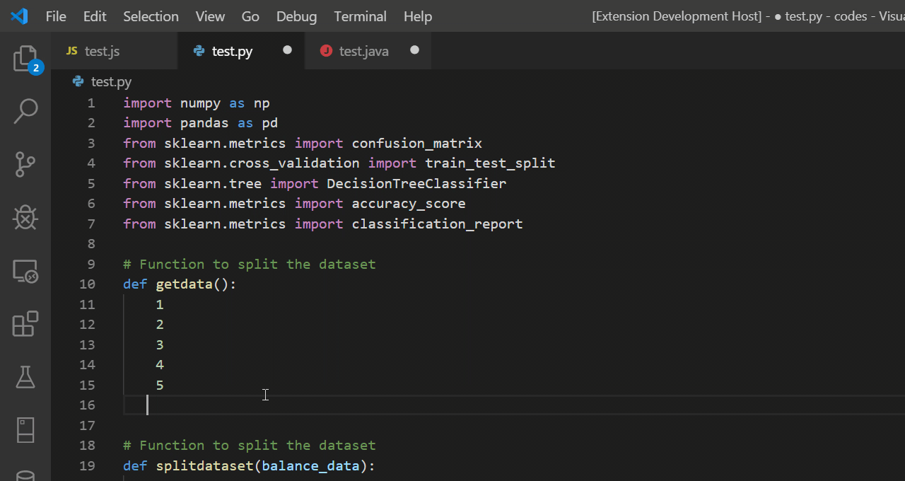

# List2Array

List2Array Is extension to simple convert raw list seprated by line break to array for programming.

## Features

Select raw list you want to convert into and launch List2Array :)

## Supported Langauges
1. java
2. javascript
3. python

> Tip: You can assign shortcut to List2Array from vs code settings.

## Release Notes

### 1.0.0

Initial release of List2Array

## Working with Markdown

**Note:** You can author your README using Visual Studio Code.  Here are some useful editor keyboard shortcuts:

* Split the editor (`Cmd+\` on macOS or `Ctrl+\` on Windows and Linux)
* Toggle preview (`Shift+CMD+V` on macOS or `Shift+Ctrl+V` on Windows and Linux)
* Press `Ctrl+Space` (Windows, Linux) or `Cmd+Space` (macOS) to see a list of Markdown snippets

### For more information

* [Visual Studio Code's Markdown Support](http://code.visualstudio.com/docs/languages/markdown)
* [Markdown Syntax Reference](https://help.github.com/articles/markdown-basics/)

**Enjoy!**
